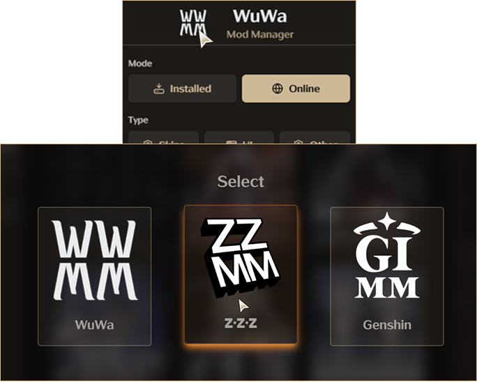
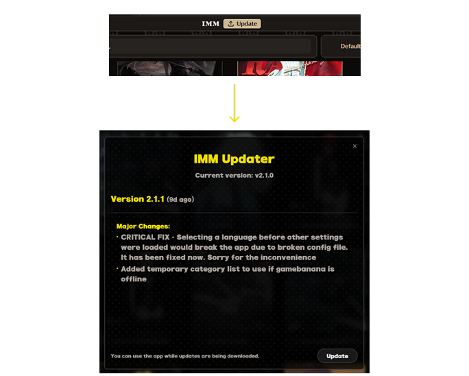

[]()  

## Overview
Integrated Mod Manager is a desktop application that streamlines mod management for Wuthering Waves, Genshin Impact & Zenless Zone Zero. With one-click toggles, customizable presets, and built-in previews, it makes applying, organizing, and managing mods effortless. It also features an integrated online mod browser, allowing users to discover and install mods directly from Gamebanana without leaving the app.

## Features

### 1. Mod Management System
#### Mod Organization

[]()  
- **Directory Scanning**: Automatically detects and lists installed mods from game directory
- **Mod Organization**: Categorized mod display with folder-based organization
---
#### Mod Management
- **Mod Status Control**: Toggle mods on/off with one click
- **Batch Operations**: Toggle multiple mods simultaneously using presets
- **Preview Mod**: Set preview images for mods to easily identify them
- **Filter Mods**: Filter mods by status (Enabled/Disabled), character, and more
- **Search Mods**: Search mods by name or categories
- **Delete Mod**: Remove unwanted mods with a couple of clicks
---
#### Restore Points
- **Backup & Restore**: Create restore points to backup mods
---

### 2. Online Mode & Installation System
#### Online Mod Browsing
- **Mod Discovery**: Browse Gamebanana's extensive online mod library with search and filtering
- **Category Filtering**: Filter mods by type (Characters, Skins, UI, etc.)
- **Mod Details**: Detailed mod information including descriptions & images
- **Download Integration**: Download mods along with their preview image directly
- **Update Tracking**: Check if any of your installed mods have a new version available
---
#### Download Manager
[]()  
- **Progress Tracking**: Real-time download progress
- **Batch Downloads**: Queue multiple mods for sequential downloading
- **Download History**: Track completed and failed downloads
- **Auto-Installation**: Automatic mod extraction and installation post-download
---
#### File Operations
- **Smart Extraction**: Intelligent ZIP/archive extraction with conflict resolution
- **Path Management**: Automatic directory structure creation and management
---
### 3. Multi-Game Support
#### Choose Between WuWa, ZZZ and GI
[]()

---
### 4. User Interface & Experience

#### Modern UI Design
- **Responsive Layout**: Adaptive interface that works on different screen sizes
- **Smooth Animations**: Fluid transitions and micro-interactions
- **Customizable Layout**: Adjustable sidebar and panel configurations

#### Navigation System
- **Multi-Panel Layout**: Left sidebar (navigation), main content, right sidebar (details)
- **Quick Actions**: Hotkey support for presets
- **Search-Driven Interface**: Quick access through global search
- **Opening External Links**: Paste a mod link ANYWHERE to open it directly in online mode
---
### 5. Configuration & Settings

##### Global/IMM Settings
[]()
#### Game Settings
[]()

- **Game Path Configuration**: Set game installation directory
- **Auto Reload XXMI/WWMI**: Automatically reload mod lists when changes are detected
- **Content Moderation**: Filter out NSFW mods from online browsing
- **Auto Launch**: Start the game (from XXMI) automatically when opening IMM

#### Hotkey Management
- **Custom Hotkeys**: Assign keyboard shortcuts to presets to change mods on the fly

#### Import/Export System
- **Configuration Backup**: Export/Import complete application settings
---
#### IMM Updates
[]()

- **Auto-Update Checker**: Notify users of new IMM versions
- **Changelog Access**: View the changelog for each new version
- **Update Directly**: Download and install the latest version from within the app
---
---

## Development Dependencies

### Windows

Tauri uses the **Microsoft C++ Build Tools** and **Microsoft Edge WebView2** for development on Windows.

1.  Download the **[Microsoft C++ Build Tools](https://visualstudio.microsoft.com/visual-cpp-build-tools/)** installer. During installation, ensure the **“Desktop development with C++”** option is checked.
2.  Visit the **[WebView2 Runtime download](https://developer.microsoft.com/en-us/microsoft-edge/webview2/#download-section)** section. Download the **“Evergreen Bootstrapper”** and install it.

### Rust

Tauri is built with Rust and requires it for development.

-   Visit **[https://www.rust-lang.org/tools/install](https://www.rust-lang.org/tools/install)** to install `rustup`.
-   Alternatively, use `winget` in PowerShell:
    ```sh
    winget install --id Rustlang.Rustup
    ```

### Node.js

-   Go to the **[Node.js website](https://nodejs.org/)**, download the Long Term Support (LTS) version, and install it.
-   Check if Node.js was installed successfully by running:
    ```sh
    node -v
    # Expected output similar to: v20.10.0
    
    npm -v
    # Expected output similar to: 10.2.3
    ```

---

## Getting Started

### Download

Clone the repository using `git`:

```sh
git clone https://github.com/jpbhatt21/integrated-mod-manager.git
```

### Install

Navigate into the project directory and install the necessary packages.

```sh
cd integrated-mod-manager && npm i
```

### Run

Run the application in development mode (needs administrator permissions).

```sh
npx tauri dev
```

### Build

Build the application for production (needs administrator permissions).

```sh
npx tauri build
```
